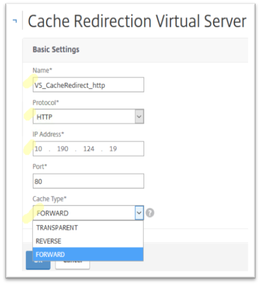
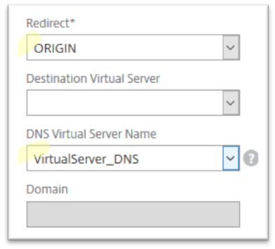

---

copyright:
  years: 2017
lastupdated: "2018-11-12"

keywords: cache, configure, configuration, http, traffic

subcollection: citrix-netscaler-vpx

---

{:shortdesc: .shortdesc}
{:codeblock: .codeblock}
{:screen: .screen}
{:new_window: target="_blank"}
{:pre: .pre}
{:table: .aria-labeledby="caption"}

# Configure Cache Redirection for HTTP(S) traffic
{: #configure-cache-redirection-for-ssl-traffic-optional-}

To configure cache redirection for HTTP or HTTPS traffic, follow these steps:

1. Go to **Traffic Management > Cache Redirection > Virtual Servers** and click **Add**.
2. Specify the name of your forward-proxy virtual server. Select the **HTTP** protocol and the **Forward** cache type from their respective drop-down lists. Then assign an IP address to this virtual server from your private subnet.

	

	Click **OK** to continue.

3. Review the summary page and click **OK**.  
4. Click **Traffic Settings** to view additional configuration settings.
5. From Traffic Settings select one of the following three redirect options, depending on your requirements:
	* **Cache** - Directs all outbound requests to your local cache server pool.
	* **Policy** - Checks the cache redirection policy to determine if the request should be forwarded to the cache server pool or to the destination servers (origin).
	* **Origin** – Directs all outbound requests to the respective destination servers (origin).

6. From the drop-down list **DNS Virtual Server Name**, select the previously-configured DNS virtual server, and set the **Redirect** option to **Origin**.

	

	**NOTE:** The **Destination Virtual Server** setting is used when outbound traffic is to be directed to the local cache server pool. Leave it empty when you want to direct all your outbound traffic to origin servers.

7. Click **OK** followed by **Done**.
