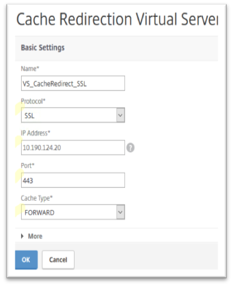
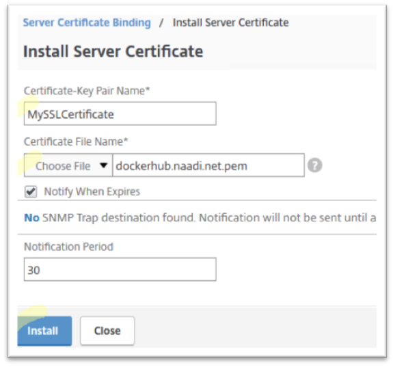
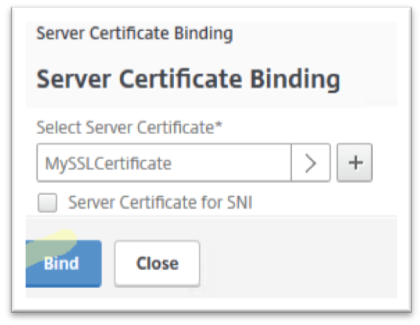

---

copyright:
  years: 2017
lastupdated: "2018-11-12"

---

{:shortdesc: .shortdesc}
{:codeblock: .codeblock}
{:screen: .screen}
{:new_window: target="_blank"}
{:pre: .pre}
{:table: .aria-labeledby="caption"}

# Configure Cache Redirection for SSL traffic (Optional)
{: #configure-cache-redirection-for-ssl-traffic-optional-}

Instead of defining cache redirection for the virtual server with an HTTP or HTTPS protocol (as discussed in the previous step), you may want to define it to handle SSL traffic. 

To do so, follow these steps:

1. Go to **Traffic Management > Cache Redirection > Virtual Servers** and click **Add**. Specify the name for your forward-proxy virtual server, select the SSL protocol and a cache type of **FORWARD**. Assign it an IP address from your private subnet, with its requisite port. 

	

	Click **OK**. 
	
2. Review the summary page and click **OK** to continue.
3. Specify your Redirect, DNS Virtual Server and Destination Virtual Server configurations. 
4. Click **Certificate** under the **Advanced Settings** panel to view the SSL certificate related configuration. 
5. Click the empty field **No Server Certificate**.
6. From the Select Server Certificate drop-down list, select your SSL server.
7. Enter the certificate configuration information as required.

	

	Click **Install**.
	
8. Select **Bind**.

	