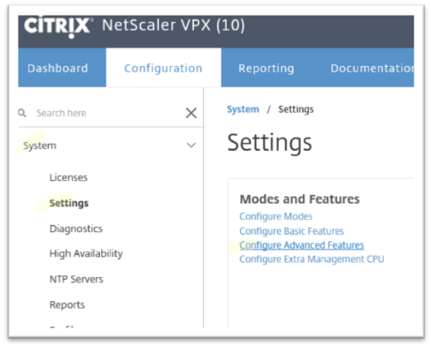

---

copyright:
  years: 2017
lastupdated: "2018-11-12"

keywords: cache, enable, redirect, capabilities

subcollection: citrix-netscaler-vpx

---

{:shortdesc: .shortdesc}
{:codeblock: .codeblock}
{:screen: .screen}
{:new_window: target="_blank_"}
{:pre: .pre}
{:table: .aria-labeledby="caption"}
{:tip: .tip}
{:note: .note}
{:important: .important}

# Enable Cache Redirection and Load Balancing capabilities
{: #enable-cache-redirection-and-load-balancing-capabilities}

To enable cache redirection and load balancing for the {{site.data.keyword.vpx_full}} appliance, perform the following steps:

1. From the {{site.data.keyword.vpx_full}} appliance system page, go to **Settings > Configure Advanced Features**, then enable **Cache Redirection** and click **OK**.  

	

	Enable any additional features as necessary.

2. Next go to **System > Settings > Configure Basic Features**, and enable **Load Balancing** (if it is not already) and click **OK**.

	Enable any additional features as necessary.
