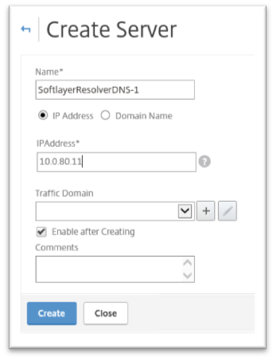
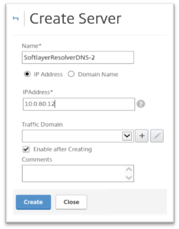
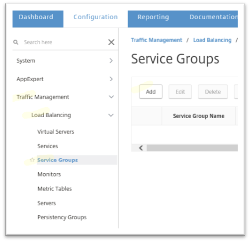
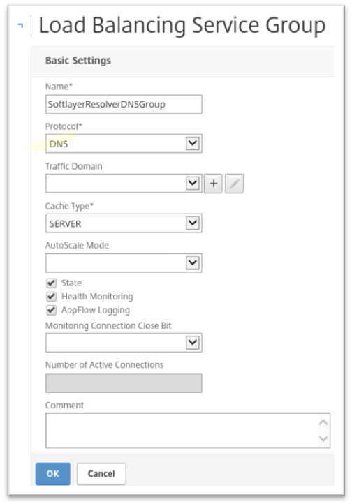
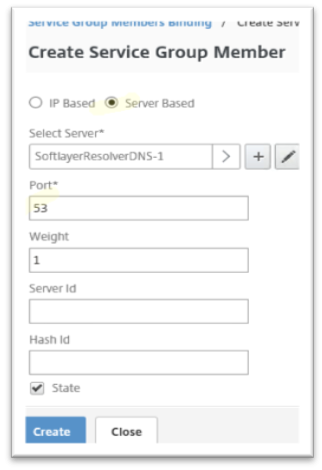
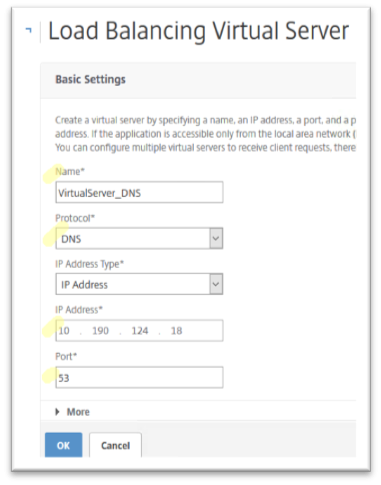
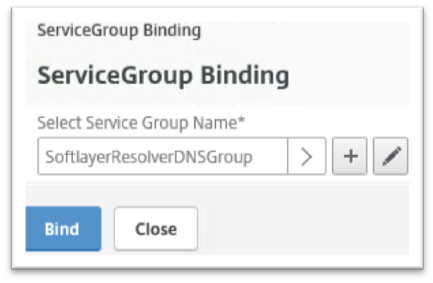
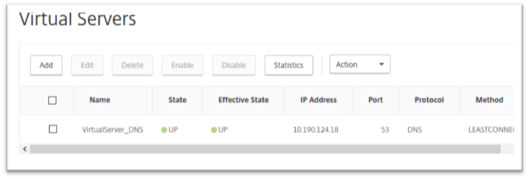

---

copyright:
  years: 2017
lastupdated: "2018-11-12"

keywords: dns, cache, virtual server

subcollection: citrix-netscaler-vpx

---

{:shortdesc: .shortdesc}
{:codeblock: .codeblock}
{:screen: .screen}
{:new_window: target="_blank"}
{:pre: .pre}
{:table: .aria-labeledby="caption"}
{:tip: .tip}
{:note: .note}
{:important: .important}

# Configure the DNS Virtual Server
{: #configure-the-dns-virtual-server}

To configure a DNS virtual server:

1. Go to Traffic Management > Load Balancing > Servers.
2. Click Add to add the two IBM© Softlayer DNS resolvers - 10.0.80.11 and 10.0.80.12.

	 

3. Next, create and define your DNS Service Group by going to Traffic Management > Load Balancing > Service Groups and selecting Add.

	

4. Select the DNS protocol, then click OK.

	

5. On the next screen add the new DNS resolvers as member servers to this DNS service group by first clicking the empty field under **Service Group Members**.

6. From the Create Service Group Member panel, specify DNS port 53, then click Create.

	

7. Click Close then click Done.

	Assuming the two IBM Softlayer DNS resolvers can be reached from your {{site.data.keyword.vpx_full}} appliance, the service group will show as green.

8. Now, go to Traffic Management > Load Balancing > Virtual Servers and click Add to define your DNS Virtual server.
9. Under Basic Settings give a name to your virtual server, choose the DNS protocol and port 53, then assign an IP address from your private subnet.

	

10. On the following page, click on the empty field labeled **No Load Balancing virtual Server ServiceGroup Binding**.
11. Select your previously-defined DNS service group from the drop-down list and click Bind.  

	

12. Click Continue followed by Done.

Your DNS virtual server state should now show as green.

