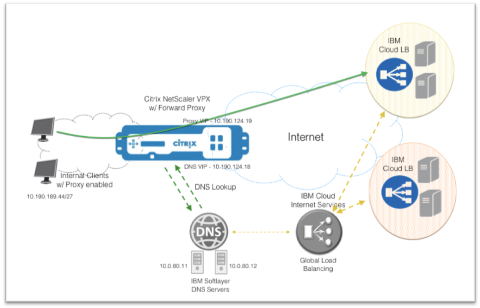

---

copyright:
  years: 2018
lastupdated: "2019-11-12"

keywords: proxy, traffic, appliance

subcollection: citrix-netscaler-vpx

---

{:shortdesc: .shortdesc}
{:codeblock: .codeblock}
{:screen: .screen}
{:new_window: target="_blank_"}
{:pre: .pre}
{:table: .aria-labeledby="caption"}
{:tip: .tip}
{:note: .note}
{:important: .important}

# Configuring forward-proxy traffic redirection using the Citrix Netscaler VPX
{: #configuring-forward-proxy-traffic-redirection-using-the-citrix-netscaler-vpx-appliance}

This guide provides you with a step-by-step configuration for a forward proxy setup using the {{site.data.keyword.vpx_full}} appliance. This configuration was tested on a {{site.data.keyword.vpx_full}} appliance running a software version of 11.1 (platinum feature edition) and 10Mbps performance.
{: shortdesc}

## What you'll accomplish
{: #what-you-ll-accomplish}

In this Step-by-Step guide you will learn how to configure the service:

Task  | Description
------------- | -------------
[Order the {{site.data.keyword.vpx_full}}](/docs/infrastructure/citrix-netscaler-vpx?topic=citrix-netscaler-vpx-order-the-citrix-netscaler-vpx-appliance) | Begin by ordering a {{site.data.keyword.vpx_full}} appliance.
[Request a Private Subnet](/docs/infrastructure/citrix-netscaler-vpx?topic=citrix-netscaler-vpx-request-a-private-subnet) | Request a private subnet from IBM© Support for your account.
[Enable Cache Redirection and Load Balancing capabilities](/docs/infrastructure/citrix-netscaler-vpx?topic=citrix-netscaler-vpx-enable-cache-redirection-and-load-balancing-capabilities) | Identify the your application's resources, such as origin pools and health check mechanisms.
[Configure the DNS Virtual Server](/docs/infrastructure/citrix-netscaler-vpx?topic=citrix-netscaler-vpx-configure-the-dns-virtual-server) | Add your DNS resolvers, define your DNS service group, then define your DNS virtual server.
[Configure Cache Redirection for HTTP(S) traffic](/docs/infrastructure/citrix-netscaler-vpx?topic=citrix-netscaler-vpx-configure-cache-redirection-for-http-traffic) | Configure the cache redirection for your forward proxy virtual server with HTTP or HTTPS traffic.
[Configure Cache Redirection for SSL traffic (Optional)](/docs/infrastructure/citrix-netscaler-vpx?topic=citrix-netscaler-vpx-configure-cache-redirection-for-ssl-traffic-optional-) | Configure the cache redirection for your forward proxy virtual server with SSL traffic instead of HTTP or HTTPS.
[Configure Source NAT for Outbound Traffic](/docs/infrastructure/citrix-netscaler-vpx?topic=citrix-netscaler-vpx-configure-source-nat-for-outbound-traffic) | Utilize your {{site.data.keyword.vpx_full}} appliance to perform NAT on outbound traffic from your client machines.
[Update the Proxy Settings on the Client Machine’s Internet Browser (Optional)](/docs/infrastructure/citrix-netscaler-vpx?topic=citrix-netscaler-vpx-update-the-proxy-settings-on-the-client-machine-s-internet-browser-optional-) | Update your proxy settings using your client machine's internet browser, if you desire.
