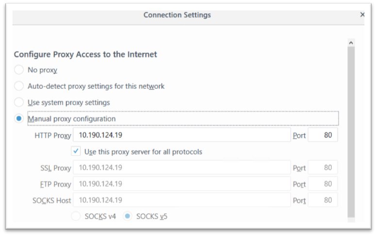

---

copyright:
  years: 2017, 2019
lastupdated: "2019-11-12"

keywords:

subcollection: citrix-netscaler-vpx

---

{:shortdesc: .shortdesc}
{:codeblock: .codeblock}
{:screen: .screen}
{:new_window: target="_blank_"}
{:pre: .pre}
{:table: .aria-labeledby="caption"}
{:tip: .tip}
{:note: .note}
{:important: .important}

# Update the proxy settings on the client machine’s internet browser (optional)
{: #update-the-proxy-settings-on-the-client-machine-s-internet-browser-optional-}

As a final, optional step to configuring forward proxy traffic redirection with your {{site.data.keyword.vpx_full}}, you can update your proxy settings using your client machine's internet browser.
{: shortdesc}

To do so, perform the following steps:

1. Go to **Internet Options** in your browser settings and configure it to use a proxy server for outgoing requests.
2. Use the IP address of your cache redirection virtual server that was defined in previous steps as your proxy.

These proxy settings might not be necessary if the {{site.data.keyword.vpx_full}} appliance is in the direct layer 3 path between client machines and the internet.
{: note}

