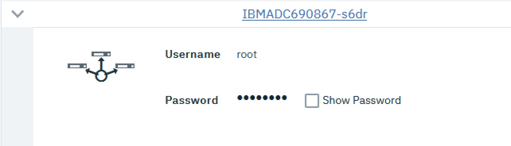
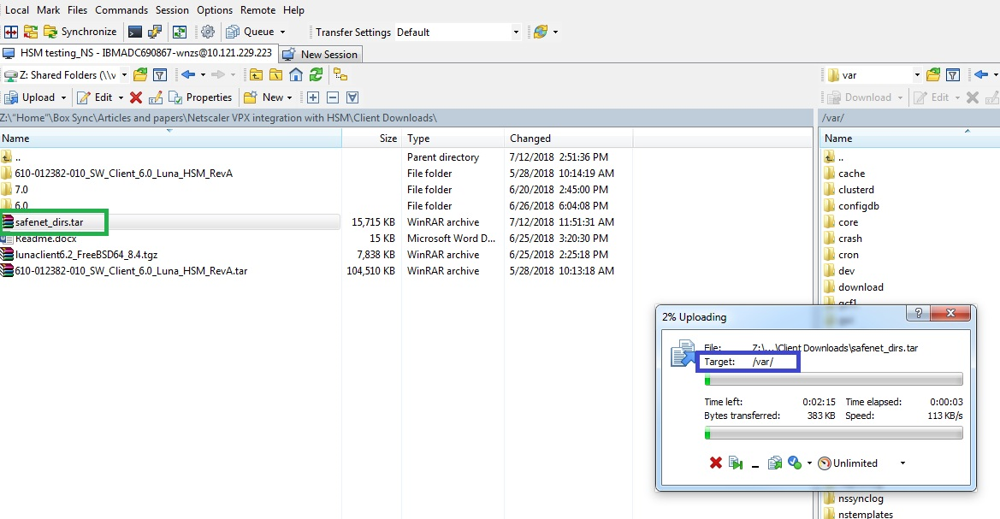

---

copyright:
  years: 2018, 2019
lastupdated: "2019-11-12"

keywords:

subcollection: citrix-netscaler-vpx


---

{:shortdesc: .shortdesc}
{:new_window: target="_blank"} 
{:codeblock: .codeblock}
{:pre: .pre}
{:screen: .screen}
{:term: .term}
{:tip: .tip}
{:note: .note}
{:important: .important}
{:deprecated: .deprecated}
{:table: .aria-labeledby="caption"}
{:external: target="_blank" .external}
{:generic: data-hd-programlang="generic”}
{:download: .download}
{:DomainName: data-hd-keyref="DomainName"}

# Install the IBM Hardware Security Module (HSM) client software
{: #install-the-ibm-hardware-security-module-hsm-client-software}

In this step, you'll install {{site.data.keyword.vpx_full}} with the software and utilities required to interact with the Hardware Security Monitor (HSM).
{: shortdesc}

Steps one and two in this procedure are optional and needed only if the safenet directory and the files or sub-folders in it are missing in the `/var` path. These resources are necessary to install VPX with the client software and allow it to run the utilities associated with the HSM software.
{: note}

Find the credentials to access the NetScaler CLI listed in the Control Portal under **Devices > Device List > Expand VPX name**.



You'll need them for this section and the remainder of the guide.

All VPX commands and outputs in this document will list either `netscalername#` (indicating a shell execution), or `>` (for the VPX CLI itself).
{: note}

1. (OPTIONAL) Obtain the `safenet_dirs.tar` file and transfer it to the VPX in the `/var` directory. Download the `safenet_dirs.tar` file in the following locations:
   - [Commercial users](http://downloads.service.softlayer.com/citrix/netscaler/Safenet-HSM/){: external} 
   - [Federal government users](http://downloads.service.usgov.softlayer.com/citrix/netscaler/Safenet-HSM/){: external}

   You must be logged into your IBM Cloud account to access the links.
   {: note}

   

   This image shows the WinSCP software transferring the `safenet_dir.tar` file into the Citrix VPX.

2. (OPTIONAL) Extract the `tar` file:

	```sh
	root@IBMADC690867-wnzs# tar -xvpf safenet_dirs.tar
	x safenet/
	x safenet/config/
	x safenet/gateway/
	x safenet/SAClient_600.tgz
	x safenet/SAClient_622.tgz
	x safenet/install_client.sh
	x safenet/gateway/start_safenet_gw
	x safenet/gateway/gw_delay
	x safenet/config/safenet_config
	x safenet/config/Chrystoki.conf
	```

3. Navigate to the `/var/safenet` directory and confirm the folders and files were transferred:

	```sh
	extracted
	root@IBMADC690867-s6dr# cd safenet
	root@IBMADC690867-s6dr# pwd
	/var/safenet

	root@IBMADC690867-s6dr# ls
	SAClient_600.tgz        config                  install_client.sh
	SAClient_622.tgz        gateway
	```

4. Execute the installation script using version 622:

	```sh
	root@IBMADC690867-s6dr# install_client.sh -v 622
	*********************************************
	Current Version: 622
	Installing Version: 622
	Starting to extract SAClient_622.tgz file.
	Extracted SAClient_622.tgz file.
	Removing SAClient_622.tgz file.

	*********************************************

	Now follow the configuration steps document available online on Citrix edocs.
	*********************************************
	```

5. Confirm the creation of the safenet directory:

	```sh
	root@IBMADC690867-s6dr# ls
	SAClient_600.tgz        gateway                 installation.log
	config                  install_client.sh       safenet
	```

6. Navigate to the `/var/safenet/config/` directoy and execute the `safenet_config` script:

	```sh
	root@IBMADC690867-s6dr# cd /var/safenet/config/
	root@IBMADC690867-s6dr# pwd               
	/var/safenet/config

	root@IBMADC690867-s6dr# sh safenet_config
	```

7. Verify that `/etc/Chrystoki.conf` and the symbolic link `/usr/lib/libCrystoki_64` were created:

	```sh
	root@IBMADC690867-s6dr# ls -l /etc/Chrystoki.conf
	-rw-r--r--  1 root  wheel  1185 Jul 26 16:17 /etc/Chrystoki.conf
	root@IBMADC690867-s6dr# ls -l /usr/lib/libCryptoki2_64.so
	lrwxr-xr-x  1 root  wheel  54 Jul 26 16:17 /usr/lib/libCryptoki2_64.so ->
	/var/safenet/safenet/lunaclient/lib/libCryptoki2_64.so
	```

The IBM Hardware Security Module has been installed successfully.
