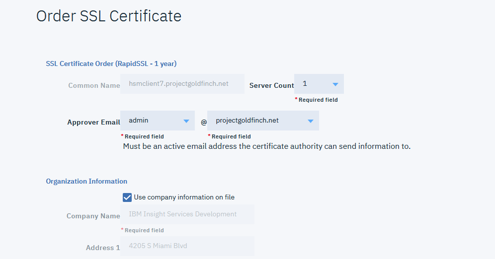

---

copyright:
  years: 2018
lastupdated: "2018-11-12"


---

{:shortdesc: .shortdesc}
{:codeblock: .codeblock}
{:screen: .screen}
{:new_window: target="_blank"}
{:pre: .pre}
{:table: .aria-labeledby="caption"}

# Order an SSL Certificate

Secure Sockets Layer (SSL) is a technology that encrypts traffic between the client application and the server application, and is accomplished by using a public key/private key system that uses an SSL certificate.

SSL certificates contain the server’s public key, dates for which the certificate is valid, a host name for which the certificate is valid, and a signature from the certificate authority that issued it.

IBM Cloud offers certificates that can be acquired and purchased without having to go through a third-party vendor/site. 

IBM Cloud offers yearly and bi-yearly SSL certificates for customers that offer various benefits, including:

* Gull authentication for business identity and domain ownership verification
* 40- to 256-bit encryption on all online transactions
* Daily website malware scanning to ensure that both your site and your customers are protected

If you are running multiple domains, an SSL certificate can be purchased for each domain.

For more information about SSL certificates refer to the following IBM Cloud articles:

* [Introduction to SSL technology
](/docs/infrastructure/ssl-certificates/intro-ssl.html#introduction-to-ssl-technology)
* [About SSL certificates](/docs/infrastructure/ssl-certificates/ssl-certificates.html#about-ssl-certificates)
* [Planning for SSL](/docs/infrastructure/ssl-certificates/planning-ahead-ssl.html#planning-for-ssl)

To order an SSL certificate for use with your Citrix Netscaler VPX, perform the following procedure:

1.	In VPX shell CLI, display the CSR text by opening the CSR file previously created in the step [Create keys and generate the Certificate Signing Request (CSR)](hsm-csr.html):

	```
	root@IBMADC690867-s6dr# cat certreqnss6dr.csr 
	-----BEGIN NEW CERTIFICATE REQUEST-----
	MIIC5jCCAc4CAQAwgaAxCzAJBgNVBAYTMRcwFQYDVQQIEw5Ob3J0aCBDYXJv
	bGluYTEPMA0GA1UEBxMGRHVyaGFtMQwwCgYDVQQKEwNJQk0xDDAKBgNVBAsTA0hT
	TTEoMCYGA1UEAxMfaHNW50Ny5wcm9qZWN0Z29sZGZpbmNoLm5ldDEhMB8G
	CSqGSIb3DQEJARYSanBtb25nZUBjci5pYm0uY29tMIIBIjANBgkqhkiG9w0BAQEF
	/pXQN+a55HhWmnyj5gThAprOoN8DeiVN+1HI+PA+g1
	r4+8dKA1xz+jPhWDQgQYb3Wnh8VK8Ouids6uFnsoc3KDymbzoWZYctp8PA6uBzJ/
	25RGiZquRu9MYJIWkQ46WQ14PoJ8BiYuJa/N6L47+Jr2vaCntmXBU4rFrjctHqq8
	Hct9q5OVYXbYLQB+MM3gYyyFBQpZ1sHZD4D6K3AISRGsOE9rrovGjUfO8mLKE6a
	AQEFBQADggEBAMe+kmdPNtt8LOpaAy+u5i9GpgHfH5zW2sX4Lj7srkqwmyxavqjE
	XvM9PPudXV9OCUWewtlm/Eqo1pYIRudFBrjg5UJyKpM4sWWdKIrTk8RZusdOUvKU
	0vBRJRJ3Yy/1olXFO05FFSotAyB9P5v9siMwdWUhM9pSiGwoNXCB74m2sxgUh10J
	H0IvDl3SL4ptosV10KJtbOiO/YV9XXNaW8/X/2uM9Y3stcnSvzJGrFlPmbhK7Vsd
	uL6/wSnV1E70CDT+KPPapzVJr/S8nP5xHVVl/5/JUGZa8rx01g9EBmX36H3T
	kHD85XOkSI4y04Y3t6pMVbIAz0vipOmHYlM=
	-----END NEW CERTIFICATE REQUEST-----
	```
	
2.	Copy the content of the file starting with `---BEGIN NEW CERTIFICATE REQUEST---` all the way to `---END NEW CERTIFICATE REQUEST---`. 

3.	Follow [these instructions](/docs/infrastructure/ssl-certificates/index.html#ordering-ssl-certificates) to place the order, pasting your CSR file text in the appropriate field. In the following example, `RapidSSL 1 Year` was chosen.

	

	As shown, the system processes and interprets the CSR text, then displays this in the following page. 

	Make sure to select a valid email account and domain/sub-domain, as this is the designated method to validate the ownership of the domain.

	Confirm your order details and click **Place Order**.

4. You will receive an order confirmation with the details of the certificate request to the account you indicated. 

	Click the enclosed link in the email to approve the domain validation request. At this point the SSL request should be ready to begin fulfilment.