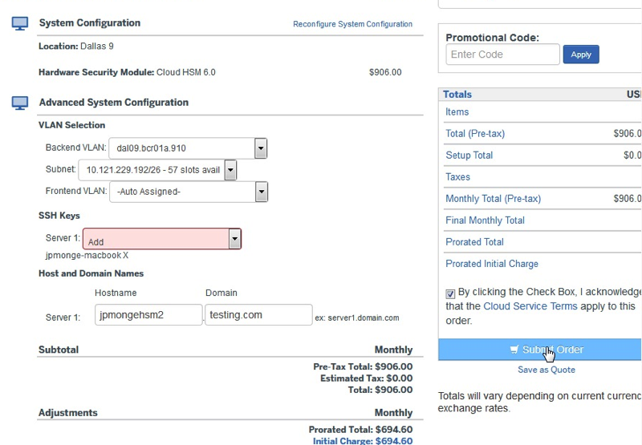

---

copyright:
  years: 2018, 2019
lastupdated: "2019-11-12"

keywords:

subcollection: citrix-netscaler-vpx

---

{:shortdesc: .shortdesc}
{:new_window: target="_blank"} 
{:codeblock: .codeblock}
{:pre: .pre}
{:screen: .screen}
{:term: .term}
{:tip: .tip}
{:note: .note}
{:important: .important}
{:deprecated: .deprecated}
{:table: .aria-labeledby="caption"}
{:external: target="_blank" .external}
{:generic: data-hd-programlang="generic”}
{:download: .download}
{:DomainName: data-hd-keyref="DomainName"}

# Order the IBM Hardware Security Module (HSM)
{: #order-the-ibm-hardware-security-module-hsm-}

First, you'll need to order the Hardware Security Monitor (HSM) for use with your {{site.data.keyword.vpx_full}}.
{: shortdesc}

To do so:

1. From your browser, open the [IBM Cloud catalog](https://cloud.ibm.com){: new_window} and log into your account.
2. Select the Menu icon  from the top left, then click **Classic Infrastructure**.
3. Click the **Order Devices** button.
4. In the Catalog page, scroll to the Security and Identity section and click the **Cloud HSM** tile.
5. Click **Continue**.
4. Select the data center you prefer, choose the **Cloud HSM 6.0** option, and click **Add to Order**.
5. Under **Advanced System Configuration**, enter your backend and frontend VLAN section information and choose **SSH Key** from the dropdown, then fill out the hostname and domain details.

    

6.	When you are finished, accept the terms and click **Submit Order**.
