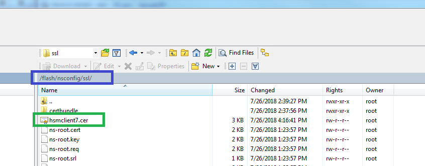

---

copyright:
  years: 2018
lastupdated: "2018-09-18"

---

{:shortdesc: .shortdesc}
{:codeblock: .codeblock}
{:screen: .screen}
{:new_window: target="_blank"}
{:pre: .pre}
{:table: .aria-labeledby="caption"}

# Retrieve and Transfer the Certificate

Retrieve the SSL certificate you ordered earlier so that you're ready for its installation and configuration in the next Step by Step, [Configuring and Tuning SSL Offload with Citrix Netscaler VPX](hsm-ssl-guide.html). 

1. Shortly after validating ownership of the domain, you should receive an email confirming the completion of the certificate fulfillment and the certificate itself.

	Copy the text from `---BEGIN CERTIFICATE---` all the way to `---END CERTIFICATE---` and save the contents as a new certificate file with an extension of `.cer`.

2. Copy the certificate file to the `/nsconfig/ssl` directoy in the Citrix Netscaler VPX.

The Citrix Netscaler VPX is now ready to incorporate the certificate into a load balancing deployment using SSL.
