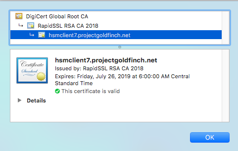

---

copyright:
  years: 2018
lastupdated: "2018-11-12"

---

{:shortdesc: .shortdesc}
{:codeblock: .codeblock}
{:screen: .screen}
{:new_window: target="_blank"}
{:pre: .pre}
{:table: .aria-labeledby="caption"}

# Create and Apply a New Cipher Suite
{: #create-and-apply-a-new-cipher-suite}

A cipher suite is a combination of authentication, encryption, Message Authentication Code (MAC) and key exchange algorithms used to negotiate the security settings for SSL and TLS protocols.

To guarantee proper authentication you must ensure your Citrix Netscaler VPX uses the best combination of ciphers.

To learn more about SSL cipher suites and other best practices visit the following links:

* [Scoring an A+ at SSLlabs.com with Citrix NetScaler ](https://www.citrix.com/blogs/2018/05/16/scoring-an-a-at-ssllabs-com-with-citrix-netscaler-q2-2018-update/){:new_window} – Q2 2018 update (refer to steps three and five in the command guide)
* [SSL and TLS Deployment Best Practices ](https://github.com/ssllabs/research/wiki/SSL-and-TLS-Deployment-Best-Practices#23-use-secure-cipher-suites){:new_window}
* [How Do I Setup ECC on NetScaler? ](https://support.citrix.com/article/CTX205289){:new_window}

**NOTE:** This topic focuses on specific and required configurations for SSL ciphers. The information in the previous links may provide additional settings that can be applied to optimize SSL operation. 

To create a new Cipher Suite that prioritizes AEAD, ECDHE, and ECDSA ciphers, perform the following procedure:

1.	Enter the following commands simultaneously in your Citrix VPX CLI, and ensure they are all applied:

	```
	add ssl cipher SSLLABS
	bind ssl cipher SSLLABS -cipherName TLS1.2-ECDHE-ECDSA-AES128-GCM-SHA256
	bind ssl cipher SSLLABS -cipherName TLS1.2-ECDHE-ECDSA-AES256-GCM-SHA384
	bind ssl cipher SSLLABS -cipherName TLS1.2-ECDHE-ECDSA-AES128-SHA256
	bind ssl cipher SSLLABS -cipherName TLS1.2-ECDHE-ECDSA-AES256-SHA384
	bind ssl cipher SSLLABS -cipherName TLS1-ECDHE-ECDSA-AES128-SHA
	bind ssl cipher SSLLABS -cipherName TLS1-ECDHE-ECDSA-AES256-SHA
	bind ssl cipher SSLLABS -cipherName TLS1.2-ECDHE-RSA-AES128-GCM-SHA256
	bind ssl cipher SSLLABS -cipherName TLS1.2-ECDHE-RSA-AES256-GCM-SHA384
	bind ssl cipher SSLLABS -cipherName TLS1.2-ECDHE-RSA-AES-128-SHA256
	bind ssl cipher SSLLABS -cipherName TLS1.2-ECDHE-RSA-AES-256-SHA384
	bind ssl cipher SSLLABS -cipherName TLS1-ECDHE-RSA-AES128-SHA
	bind ssl cipher SSLLABS -cipherName TLS1-ECDHE-RSA-AES256-SHA
	bind ssl cipher SSLLABS -cipherName TLS1.2-DHE-RSA-AES128-GCM-SHA256
	bind ssl cipher SSLLABS -cipherName TLS1.2-DHE-RSA-AES256-GCM-SHA384
	bind ssl cipher SSLLABS -cipherName TLS1-DHE-RSA-AES-128-CBC-SHA
	bind ssl cipher SSLLABS -cipherName TLS1-DHE-RSA-AES-256-CBC-SHA
	bind ssl cipher SSLLABS -cipherName TLS1-AES-128-CBC-SHA
	bind ssl cipher SSLLABS -cipherName TLS1-AES-256-CBC-SHA
	```
	
	The syntax for the previous commands is the following:

	```
	add ssl cipher <cipherGroupName>
	bind ssl cipher <cipherGroupName> -cipherName <string>
	```

2.	Confirm the cipher was added to your Citrix Netscaler VPX:

	```
	> show ssl cipher SSLLABS
	1)      Cipher Name: TLS1.2-ECDHE-ECDSA-AES128-GCM-SHA256       Priority : 1
	        Description: TLSv1.2 Kx=ECC-DHE  Au=ECDSA Enc=AES-GCM(128) Mac=AEAD   HexCode=0xc02b
	2)      Cipher Name: TLS1.2-ECDHE-ECDSA-AES256-GCM-SHA384       Priority : 2
	        Description: TLSv1.2 Kx=ECC-DHE  Au=ECDSA Enc=AES-GCM(256) Mac=AEAD   HexCode=0xc02c
	3)      Cipher Name: TLS1.2-ECDHE-ECDSA-AES128-SHA256   Priority : 3
	        Description: TLSv1.2 Kx=ECC-DHE  Au=ECDSA Enc=AES(128)  Mac=SHA-256   HexCode=0xc023
	4)      Cipher Name: TLS1.2-ECDHE-ECDSA-AES256-SHA384   Priority : 4
	        Description: TLSv1.2 Kx=ECC-DHE  Au=ECDSA Enc=AES(256)  Mac=SHA-384   HexCode=0xc024
	5)      Cipher Name: TLS1-ECDHE-ECDSA-AES128-SHA        Priority : 5
	        Description: SSLv3 Kx=ECC-DHE  Au=ECDSA Enc=AES(128)  Mac=SHA1   HexCode=0xc009
	6)      Cipher Name: TLS1-ECDHE-ECDSA-AES256-SHA        Priority : 6
	        Description: SSLv3 Kx=ECC-DHE  Au=ECDSA Enc=AES(256)  Mac=SHA1   HexCode=0xc00a
	7)      Cipher Name: TLS1.2-ECDHE-RSA-AES128-GCM-SHA256 Priority : 7
	        Description: TLSv1.2 Kx=ECC-DHE  Au=RSA  Enc=AES-GCM(128) Mac=AEAD   HexCode=0xc02f
	8)      Cipher Name: TLS1.2-ECDHE-RSA-AES256-GCM-SHA384 Priority : 8
	        Description: TLSv1.2 Kx=ECC-DHE  Au=RSA  Enc=AES-GCM(256) Mac=AEAD   HexCode=0xc030
	9)      Cipher Name: TLS1.2-ECDHE-RSA-AES-128-SHA256    Priority : 9
	        Description: TLSv1.2 Kx=ECC-DHE  Au=RSA  Enc=AES(128)  Mac=SHA-256   HexCode=0xc027
	10)     Cipher Name: TLS1.2-ECDHE-RSA-AES-256-SHA384    Priority : 10
	        Description: TLSv1.2 Kx=ECC-DHE  Au=RSA  Enc=AES(256)  Mac=SHA-384   HexCode=0xc028
	11)     Cipher Name: TLS1-ECDHE-RSA-AES128-SHA  Priority : 11
	        Description: SSLv3 Kx=ECC-DHE  Au=RSA  Enc=AES(128)  Mac=SHA1   HexCode=0xc013
	12)     Cipher Name: TLS1-ECDHE-RSA-AES256-SHA  Priority : 12
	        Description: SSLv3 Kx=ECC-DHE  Au=RSA  Enc=AES(256)  Mac=SHA1   HexCode=0xc014
	13)     Cipher Name: TLS1.2-DHE-RSA-AES128-GCM-SHA256   Priority : 13
	        Description: TLSv1.2 Kx=DH       Au=RSA  Enc=AES-GCM(128) Mac=AEAD   HexCode=0x009e
	14)     Cipher Name: TLS1.2-DHE-RSA-AES256-GCM-SHA384   Priority : 14
	        Description: TLSv1.2 Kx=DH       Au=RSA  Enc=AES-GCM(256) Mac=AEAD   HexCode=0x009f
	15)     Cipher Name: TLS1-DHE-RSA-AES-128-CBC-SHA       Priority : 15
	        Description: SSLv3 Kx=DH       Au=RSA  Enc=AES(128)  Mac=SHA1   HexCode=0x0033
	16)     Cipher Name: TLS1-DHE-RSA-AES-256-CBC-SHA       Priority : 16
	        Description: SSLv3 Kx=DH       Au=RSA  Enc=AES(256)  Mac=SHA1   HexCode=0x0039
	17)     Cipher Name: TLS1-AES-128-CBC-SHA       Priority : 17
	        Description: SSLv3 Kx=RSA      Au=RSA  Enc=AES(128)  Mac=SHA1   HexCode=0x002f
	18)     Cipher Name: TLS1-AES-256-CBC-SHA       Priority : 18
	        Description: SSLv3 Kx=RSA      Au=RSA  Enc=AES(256)  Mac=SHA1   HexCode=0x0035
 	Done
 	```
	
3.	Unbind the default Cipher Suite from your virtual server and bind the custom group created in the previous step:
	
	```
	unbind ssl vserver https_vip2 -cipherName DEFAULT
	
	bind ssl vserver https_vip2 -cipherName SSLLABS
	
	bind ssl vserver https_vip2 -eccCurveName ALL
	```
	
	The syntax for the previous commands is:
	
	```
	unbind ssl cipher <cipherGroupName> -cipherName <string>
	bind ssl vserver <vServerName> -cipherName <string>
	bind ssl vserver <vServerName> -eccCurveName <eccCurveName>
	```
	
4.	Confirm the changes in your virtual server:
	
	```
	> show ssl vserver https_vip2
	
	[OUTPUT OMITTED]
		ECC Curve: P_256, P_384, P_224, P_521
	
	1)      CertKey Name: hsmclient7ns      Server Certificate
	
	1)      Cipher Name: SSLLABS
		Description: User Created Cipher Group
 	Done
	```
	
5.	(OPTIONAL) HTTP Redirection can be enabled to redirect users to a secure web site when they create an HTTP request (as opposed to HTTPS).
 
	See [How to Configure HTTP to HTTPS Redirection on NetScaler ](https://support.citrix.com/article/CTX201201){:new_window} for configuration instructions.

6.	Test the HTTPS connection by opening a web browser and entering the FQDN. The site should load the content rendered by the HTTP service behind the Citrix VPX.

	You can also view the certificate details by clicking the padlock icon next to the URL in your browser to display the certificate info. 
	
	
	
	If redirection was configured in step five, the secure site will also load when using an HTTP request.
