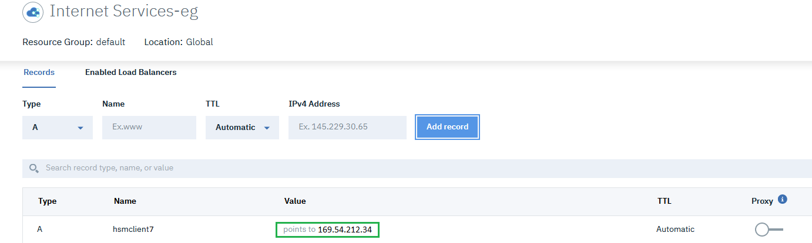
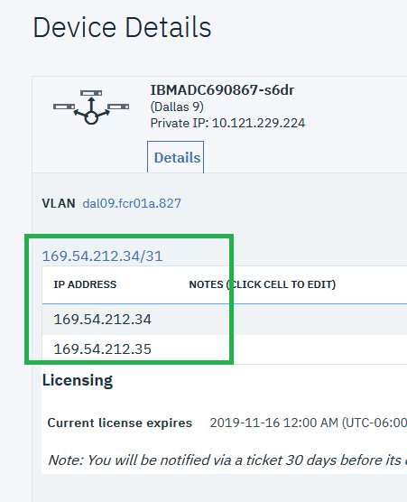

---

copyright:
  years: 2018
lastupdated: "2019-11-12"

keywords: hsm, ssl, dns, security, check, configure

subcollection: citrix-netscaler-vpx

---

{:shortdesc: .shortdesc}
{:codeblock: .codeblock}
{:screen: .screen}
{:new_window: target="_blank_"}
{:pre: .pre}
{:table: .aria-labeledby="caption"}
{:tip: .tip}
{:note: .note}
{:important: .important}

# Check and configure the DNS record
{: #check-and-configure-the-dns-record}

In this Step by Step example, the DNS service from IBM© Cloud Internet Services is used to manage the DNS zone and its records. In this case, you must ensure a record is created for the FQDN being used. The record should point to the public address to be configured in the {{site.data.keyword.vpx_full}} virtual server.
{: shortdesc}

The static public IP to be used with the Citrix VPX can be retrieved from the IBM Cloud catalog from the [Device List](/docs/citrix-netscaler-vpx?topic=citrix-netscaler-vpx-managing-your-citrix-netscaler-vpx#locating-netscaler-details-in-the-customer-portal) and then selecting the name of your {{site.data.keyword.vpx_full}}.

