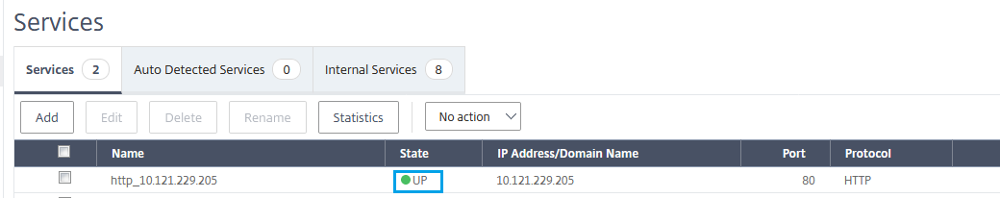
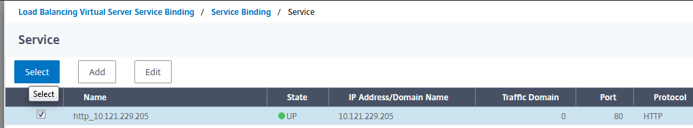

---

copyright:
  years: 2018
lastupdated: "2018-11-12"

keywords:

subcollection: citrix-netscaler-vpx

---

{:shortdesc: .shortdesc}
{:codeblock: .codeblock}
{:screen: .screen}
{:new_window: target="_blank_"}
{:pre: .pre}
{:table: .aria-labeledby="caption"}
{:tip: .tip}
{:note: .note}
{:important: .important}

# Add and configure the SSL virtual server
{: #add-and-configure-the-ssl-virtual-server}

You can add and configure your SSL Virtual Server for use with the Hardware Security Monitor (HSM) of your {{site.data.keyword.vpx_full}}.
{: shortdesc}

To do so, perform the following procedure:

1. Navigate to **System > Settings > Configure Basic Features**. Select **SSL Offloading** then click **OK**.
2. In the NetScaler GUI, navigate to **Traffic Management > Load Balancing > Services > Add**, and specify the name, the IP address, and set the protocol as **HTTP**. Select **OK** to finish.
3. Confirm the service is operational:

	

4. Repeat step two for any additional servers.
5. Navigate to **Traffic Management > Load Balancing > Virtual Servers >** and click **Add**. Specify the name and select **SSL** as the Protocol, then enter the public IP Address. Select **OK** to finish.
6. Now select **No Load Balancing Virtual Server Service Binding** and click **Select**. Select the service(s) you created in the previous steps and click **Select**, then click **Bind/Continue**.

	

7. Finally, click **No Server Certificate**, then click **Select Server Certificate** and select the certificate you installed earlier. Click **Select**, then **Bind/Continue**, then **DONE** to finish.
