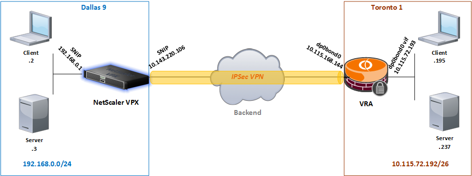

---

copyright:
  years: 2017, 2026
lastupdated: "2026-01-23"

keywords:

subcollection: citrix-netscaler-vpx

---

{{site.data.keyword.attribute-definition-list}}

# Configuring IPsec site-to-site VPN in Citrix Netscaler VPX with IBM Virtual Router Appliance
{: #configuring-ipsec-site-to-site-vpn-in-citrix-netscaler-vpx}

This guide provides step-by-step instructions to configure an IPsec VPN site-to-site connection in the {{site.data.keyword.vpx_full}}. An IBM Virtual Router Appliance (VRA) is used as a VPN peer.
{: shortdesc}

{: caption="IPsec VPN connection" caption-side="bottom"}

## About the deployment
{: #about-ipsec}

This deployment was built and tested with the following component specifications:

| NetScaler VPX Version & Build	| VRA Version & Description |
| ------------- | ------------- |
| NS12.1: Build 48.13.nc | AT&T vRouter 5600 1801q |
{: caption="Component specifications" caption-side="bottom"}

You need a VPX Platinum license to configure IPsec VPN.
{: note}

## Before you begin
{: #before-you-begin-ipsec}

This guide assumes ownership of both devices. Visit the following links for instructions on ordering.

-	[Getting started with {{site.data.keyword.vpx_full}} Software Appliance](/docs/citrix-netscaler-vpx?topic=citrix-netscaler-vpx-getting-started)
-	[Getting Started with IBM Virtual Router Appliance](/docs/virtual-router-appliance?topic=virtual-router-appliance-getting-started-vra)

## What you can accomplish
{: #accomplish}

In this guide, you learn how to configure an IPsec VPN in the Citrix VPX device.

| Task | Description |
| ------------- | ------------- |
| [Enable Features in VPX](/docs/citrix-netscaler-vpx?topic=citrix-netscaler-vpx-enable-required-features-in-vpx) | First, enable the required features to create the IPsec VPN. |
| [Create IPsec Profile](/docs/citrix-netscaler-vpx?topic=citrix-netscaler-vpx-creating-ipsec-profile) | The IPsec profile includes security parameters for establishing the connection. |
| [Create IP Tunnel](/docs/citrix-netscaler-vpx?topic=citrix-netscaler-vpx-creating-ip-tunnel) | In this section, you create an IP tunnel object to specify both local and remote IP addresses, as well as protocol parameters. |
| [Create Policy Based Routing (PBR)](/docs/citrix-netscaler-vpx? topic=citrix-netscaler-vpx-creating-policy-based-routing) | PBR is used to define the unique traffic parameters for both local and remote subnets. |
| [Configure VRA](/docs/citrix-netscaler-vpx?topic=citrix-netscaler-vpx-configuring-vra) | Configure the Virtual Router Appliance by using equivalent VPN configuration syntax. |
| [Verify VPN Status](/docs/citrix-netscaler-vpx?topic=citrix-netscaler-vpx-verifying-vpn-tunnel-connection) | Verify the VPN operation state and conduct a simple connectivity test. |
{: caption="What you'll accomplish" caption-side="bottom"}

## Extra resources
{: #additional-resource}

The following extra resources can help you learn more about Citrix VPX and Virtual Router Appliance.

* [CloudBridge Connector](https://docs.netscaler.com/en-us/citrix-adc/current-release/getting-started-with-citrix-adc.html){: external}
* [Citrix VPX/ADC 12.1 Documentation](https://docs.netscaler.com/en-us/citrix-adc/12-1){: external}
* [Supplemental VRA Documentation](/docs/virtual-router-appliance?topic=virtual-router-appliance-supplemental-vra-documentation)
