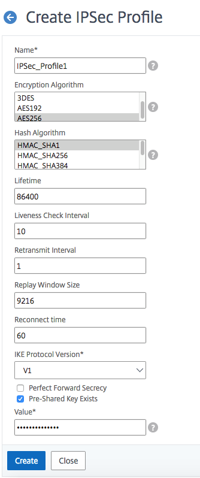

---

copyright:
  years: 2019
lastupdated: "2019-11-13"

keywords:

subcollection: citrix-netscaler-vpx


---

{{site.data.keyword.attribute-definition-list}}

# Creating IPsec profile VPX
{: #creating-ipsec-profile}

You can create an IPsec profile that includes security parameters for establishing connections with your {{site.data.keyword.vpx_full}}.
{: shortdesc}

To create a profile, perform the following procedure:

1.	Navigate to **System > CloudBridge Connector > IPsec Profile** and click **Add**.
2.	Enter the following parameters:
    *	**Name**
    *	**Encryption Algorithm**
    *	**Hash Algorithm**
    *	**Lifetime**
3.	Select the appropriate **IKE Protocol Version**.
4.	Check **Perfect Forward Secrecy** if desired.
5.	Check **Pre-Shared Key Exists** and enter the PSK in the **Value** field.
6.	Click **Create**.

    {: caption="Create IPsec profile" caption-side="bottom"}


To create an IPsec profile in the CLI, use the following syntax:

   ```sh
   > add ipsec profile IPsec_Profile1 -ikeVersion V1 -encAlgo AES256 -hashAlgo HMAC_SHA1 -lifetime 86400 -psk ipsecpskvpxvra

   ```
