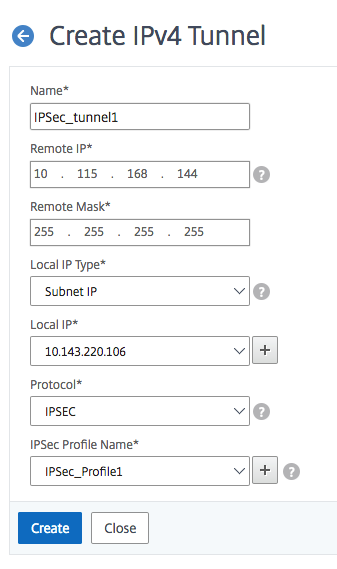

---

copyright:
  years: 2019
lastupdated: "2019-11-13"

keywords:

subcollection: citrix-netscaler-vpx


---

{{site.data.keyword.attribute-definition-list}}

# Creating an IP tunnel
{: #creating-ip-tunnel}

You need to create an IP tunnel object to specify not only the local and remote IP addresses, but also the protocol parameters for the VPN connection to use with your {{site.data.keyword.vpx_full}}.
{: shortdesc}

To do so:

1.	Navigate to **System > CloudBridge Connector > IP Tunnels**.
2.	On the **IPv4 Tunnels tab**, click **Add**.
3.	Enter the following parameters:
    *	**Name**
    *	**Remote IP** (IP of remote VPN peer)
    *	**Remote Mask**
4.	Select **Subnet IP** (SNIP) in the Local IP list.
5.	Choose the appropriate SNIP to be used as the VPN endpoint from the **Local IP** list.
6.	Select **IPSEC** as the protocol from the list.
7.	Choose the [previously created](/docs/citrix-netscaler-vpx?topic=citrix-netscaler-vpx-enable-required-features-in-vpx) profile name from the **IPsec Profile Name** list.
8.	Click **Create**.

    {: caption="Create IP tunnel" caption-side="bottom"}


To create an IP tunnel in the CLI, use the following syntax:

   ```sh
   > add ipTunnel IPsec_tunnel1 10.115.168.144 255.255.255.255 10.143.220.106 -protocol IPSEC -ipsecProfileName IPsec_Profile1
   ```
