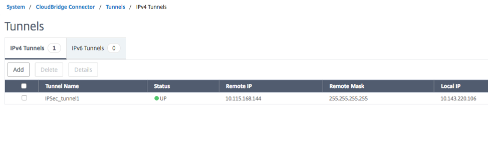

---

copyright:
  years: 2019
lastupdated: "2019-11-13"

keywords: ipsec, vpn, vpx, tunnel

subcollection: citrix-netscaler-vpx


---

{:shortdesc: .shortdesc}
{:codeblock: .codeblock}
{:screen: .screen}
{:new_window: target="_blank_"}
{:pre: .pre}
{:table: .aria-labeledby="caption"}
{:tip: .tip}
{:note: .note}
{:important: .important}

# Verifying VPN Tunnel Connection
{: #verifying-vpn-tunnel-connection}

There are procedures and commands that will help you verify the operational status of the VPN connection with your {{site.data.keyword.vpx_full}}.
{: shortdesc}

1.	Confirm the VPN status in VPX by navigating to **System > CloudBridge Connector > IP Tunnels**.

  

  The Status should reflect an **UP** state in the respective IP tunnel entry (**IPsec_tunnel1** in this example.)

  To confirm the status of the VPN connection using the CLI, run the following command:

  ```    
  > show iptunnel
  1) Domain.......:               0
    Name.........:  IPsec_tunnel1 (TUN1)
    Remote.......:  10.115.168.144   Mask......: 255.255.255.255
    Local........:  10.143.220.106   Encap.....:  10.143.220.106
    Protocol.....:           IPSEC   Type......:               C
    IPsec Profile Name.......:  IPsec_Profile1
    IPsec Tunnel Status......:              UP
    Number of PBRs ..........:               1

    Done

  ```

2.	Confirm the VPN status in VRA by executing the following command in the CLI to confirm the VPN state:

  ```
  $ show vpn ipsec sa
  Peer ID / IP                            Local ID / IP
  ------------                            -------------
  10.143.220.106                          10.115.168.144

  Tunnel  Id          State  Bytes Out/In   Encrypt       Hash      DH A-Time  L-Time
  ------  ----------  -----  -------------  ------------  --------  -- ------  ------
  1       1           up     0.0/0.0        aes256        sha1      2  18466   86400
  ```

  3.	Test your VPN connectivity by issuing a ping from the VSI behind the Citrix VPX to the VSI in the remote (Virtual Router Appliance) side:

  ```
  >ping 10.115.72.237

  Pinging 10.115.72.237 with 32 bytes of data:
  Reply from 10.115.72.237: bytes=32 time=37ms TTL=63
  Reply from 10.115.72.237: bytes=32 time=36ms TTL=63
  Reply from 10.115.72.237: bytes=32 time=35ms TTL=63
  Reply from 10.115.72.237: bytes=32 time=35ms TTL=63

  Ping statistics for 10.115.72.237:
      Packets: Sent = 4, Received = 4, Lost = 0 (0% loss),
  Approximate round trip times in milli-seconds:
      Minimum = 35ms, Maximum = 37ms, Average = 35ms
  ```
