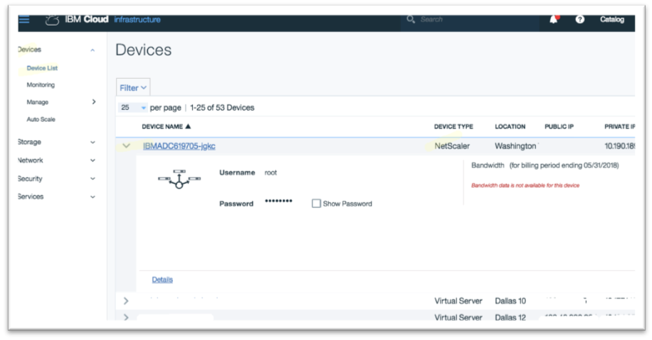

---

copyright:
  years: 2017
lastupdated: "2018-11-12"

keywords: order, vpx, setup

subcollection: citrix-netscaler-vpx

---

{:shortdesc: .shortdesc}
{:codeblock: .codeblock}
{:screen: .screen}
{:new_window: target="_blank"}
{:pre: .pre}
{:table: .aria-labeledby="caption"}
{:tip: .tip}
{:note: .note}
{:important: .important}

# Order the Citrix NetScaler VPX appliance
{: #order-the-citrix-netscaler-vpx-appliance}

From your browser, open the [Customer Portal ](https://control.softlayer.com/){: new_window} and log into your account. Then:

1. Click **Catalog** on the top right corner of the screen.
2. Under the Infrastructure panel on left, navigate to **Network > Load Balancers**.
3. Select the **Citrix NetScaler VPX** offering and click **Create**.
4. Select your data center and preferred VPX appliance - software version, performance level and feature edition.

	The cache redirection capability is not available with the Standard edition of the VPX, so select the Platinum feature edition. The portal will also ask for your desired number of public IP addresses. Select one public IP (included free with your order) then click **Continue**.

5. On the next screen, provide the information requested about your IP addresses.
6. Review your purchase order, accept the service agreement and click **Place Order**.

You will be taken to the infrastructure summary page, and you can find your Citrix NetScaler VPX appliance at **Devices > Device List**. Review and confirm the device details for login credentials and its public and private IP addresses.

  
